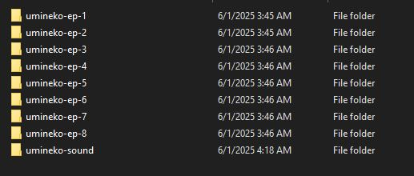

# umineko_reader

personal project that i though i would share, simple reader hardcoded for umineko using flutter i made in a day for reading it with music and sound effects on pc based on the Sound Manga Reader project. 

The images are on the their discord https://discord.gg/6ByuEA6R and the music need to be on mp3 so convert the ones from from the discord as well or download here, 

https://mega.nz/file/3AMBzLIR#Uz7sRrX0tmzIbJSk_vhWL3ajzqDNA7Zi8QD5ZFdtZKw, 

to run download the release.rar, extract and run umineko_reader

the chosen folder structure should be like the image 

